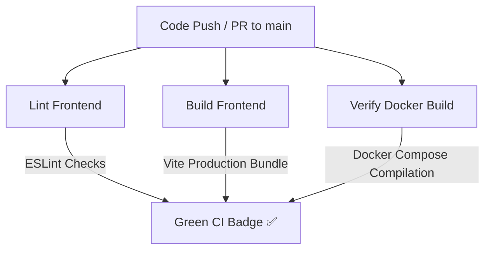

# 🪐 BlogPlatform

[](https://github.com/PJAYANTH2006/Blog/actions)

A state-of-the-art, developer-centric pseudonymous blogging platform. This workspace features a full-stack architecture combining a high-performance Express/MongoDB backend with an immersive, glassmorphic React/Vite client.

---

## 🎨 Dual-Theme Design Aesthetics
The interface leverages custom CSS/HSL design variables to provide two contrasting, premium publication environments:
*   **Light Mode ("System.out Slate")**: A soft cream-slate e-paper theme inspired by modern developer documentations (like Linear or Stripe) featuring charcoal-slate typography and liquid gold highlights.
*   **Dark Mode ("System.out Space")**: An immersive deep-cosmic space theme utilizing frosted dark-glass bento panels, glowing ambient shadows, and vibrant neon status indicators.
*   **Instant Sync**: Active themes persist in the browser's `localStorage` and automatically sync in real-time across multiple open browser tabs.

---

## 🛠️ Technology Stack
*   **Frontend (Client)**: React 19, Vite, Framer Motion (micro-animations), Lucide Icons, Vanilla CSS Grid & Flex layouts.
*   **Backend (API Server)**: Node.js, Express, MongoDB, Mongoose ODM, JWT Auth, Multer (media storage).
*   **Containerization**: Docker Compose (`docker-compose.yml`, Dockerfiles for modular container scaling).
*   **Automation**: GitHub Actions CI Pipeline.

---

## 🤖 Continuous Integration Pipeline (GitHub Actions)
The repository is backed by a fully automated Continuous Integration (CI) environment configured in [`.github/workflows/ci.yml`](.github/workflows/ci.yml). On every code push or pull request to the `main` or `master` branches, GitHub Actions spawns concurrent container runners to perform:



1.  **`lint-frontend`**: Spawns an `ubuntu-latest` virtual machine, sets up Node.js with caching, installs dependencies, and runs `npm run lint` to enforce ESLint code styling regulations.
2.  **`build-frontend`**: Validates compile-safety by building production-ready assets (`npm run build`).
3.  **`docker-build`**: Validates the health of the container deployment configuration by compiling all microservices via `docker compose build`.

---

## 🚀 Local Development Setup

### Prerequisites
*   Node.js (v20 or higher)
*   MongoDB running locally on port `27017` (or Docker)

### 1. Database Seeding
Populate your database with rich, premium sample data (e.g., sample articles, mock authors like E. Codd, G. Hinton, and threaded comments):
```bash
cd backend
npm install
node seed.js
```

### 2. Run Backend & Frontend Locally
Run the Express server and Vite development servers simultaneously in separate terminals:

**Backend Server (Runs on port `5000`):**
```bash
cd backend
npm run dev
```

**Frontend Client (Runs on port `5173`):**
```bash
cd frontend
npm install
npm run dev
```

### 3. Running via Docker Compose
If you have Docker Desktop active, spin up the entire database, backend, and frontend environment with a single command:
```bash
docker compose up --build -d
```
The application will automatically be available at:
*   Frontend: [http://localhost:5173/](http://localhost:5173/)
*   Backend: [http://localhost:5000/api/health](http://localhost:5000/api/health)
